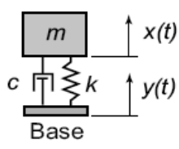

# Digital Twins -- A Simple Example for Engineers

As an engineer, I try to ignore the marketing hype until something becomes
relevant to me.  So when a member of our marketing team asked me if I knew
anything about "Digital Twin" technology, I admitted I had never heard of it.
However, after a quick Google search, it was pretty obvious that I had been
practicing/advocating digital twin technology for nearly a decade (just not as a
part of some of the giant companies that are now pushing the "Digital Twin"
marketing lingo).  So now, to add some concrete math and code to the "Digital
Twin" hype, I'll go through a simple example that is based around a simple
undergraduate mechanical engineering concept.  All units will be in metric,
because science.

## Simplified Automotive Suspension (AKA Mass-Spring-Damper System)

The mass-spring-damper system is governed by the
following differential equation:

$$ m\ddot{x} + c\dot{x} + kx = c\dot{y} + ky $$

This result can be derived with some Physics 101 knowledge by building a free
body diagram and substituting the forces into Newton's Second Law of Motion
equation. Note that $c$ represents the damper coefficient, and $k$ represents
the spring coefficient.  If differential equations aren't your thing, the spring
resistance changes with _position_ of the mass/base while the damper resistance
changes with _velocity_ of the mass/base.

For this system, there are some other important equations and concepts that will
become relevant.  I won't go into their derivation, but you can find a fairly
thorough example
[here](http://pioneer.netserv.chula.ac.th/~anopdana/263/ch34.pdf).

#### Undamped Natural Frequency, $\omega_n$
This is the frequency at which the system will vibrate if there is no damping.
It can be calculated by the simple equation:
$$ \omega_n = \sqrt{\frac{k}{m}} $$

#### Damped Natural Frequency, $\omega_d$
This is the frequency at which the system will _actually_ vibrate.

$$ \omega_d = \omega_n \sqrt{1 - \zeta^2} $$

where $\zeta$ is defined as the _damping ratio_, and is defined by the equation:

$$ \zeta = \frac{c}{2m\omega_n} $$

#### Solving these equations
For a setting of m, c, k, the position of the mass over time when a car goes
over a bump with a height x, looks like:

## Designing the Suspension
Automotive engineer, Pat, works for a hot new automotive company, ALSET.  Pat is
helping to design a new luxury sedan that will turn the industry upside down
because it will be built with Digital Twin technology.  Pat is in charge of the
suspension, and is under a time crunch, so the simplified model shown above is
chosen.

Because Pat is working on a luxury sedan, Pat will design the suspension to be
comfortable. This means that he will design for roughly 1HZ oscillation
frequency, which will decay to less than 5% of max displacement after 3 seconds.
The target mass of the car is fixed at 2400kg and is evenly distributed between
all four wheels.  This means each mass-spring-damper system will have a mass of
2400kg/4 = 600kg.  Using the given constraints and the modeling equations above,
Pat can solve for K and C that will theoretically yield the following curve when
the car drives over a 0.1m bump:

Pat's designs are put into the prototype and everyone loves the way the car
rides, but this just step one of the digital twin process.

## Sensing Suspension Behavior
Though Pat has done some nice digital modeling, the boss, Nole, is not yet
satisfied.  **A core part of the digital twin concept is tracking the real-world
item through its lifetime, and making constant comparisons between it and the
digital model.**  To make this possible, Pat mounts an accelerometer on each
corner of the chassis, and hooks each one into the on-board control module.  This
module periodically streams data from the suspension and other critical systems
to ALSET servers.

Before the design is set for production, the prototype car drives on a test
track while streaming data from all the on-board sensors.  Pat pays special
attention to the "bumps" portion of the course. This portion sends the car over
0.1m, 0.2m, and 0.3m bumps, which yields the following acceleration/time graphs:

Because of design changes in other parts of the sedan, the results don't match
Pat's model exactly.  However, it is easy to use these data to infer a new
model, so Pat does just that.

After a test production run, 10 cars are randomly sampled to drive on the test
track, their results are all nearly identical to the prototype.

## Leveraging Twin Data Right Away
Five thousand cars are sold the first week after they launch, and Pat receives
suspension data from each of them. At this scale, it can be seen that there is
more variance than desired for some of the key performance constraints.  There
have been no customer complaints, but Pat notifies the production team, and
measures are in put in place to assemble the suspension with greater
consistency.

## Big Paybacks in the long run
A year later, some warranty claims begin trickling in.  The main complaint is
unwanted shaking/vibration.  Pat looks at the data from some of the claims, and
sees something like this:

As a seasoned suspension expert, Pat knows this extra vibration is probably due
to a worn bushing or failure of some other rubber component, and alerts the
repair technicians.  Most repair technicians find that the upper spring seat is
severely worn to the point of failure.   In addition, the OEM supplier for this
part has been flaky, and the due to high production demands, the production team
had to work with several backup suppliers and had trouble tracking which version
of the part went into each car.  Total failure of this part could cause
unpredictable failures, and Nole is on the verge of issuing a massive recall.
He is livid because replacing the part requires removing most of the suspension,
and is very time consuming.  Before the recall, Nole puts all hands toward
finding a better solution.

While combing through the data of all the failures, Pat realizes that there were
signs of the imminent failure, long before anyone reported a problem.  **Though
they aren't able to directly identify cars with faulty parts, they can monitor
their entire fleet, and determine if something has gone awry.** Nole is
relieved, and Pat is a hero.  Pat works with an ALSET data scientist to finalize
a predictive model, which works by comparing the real-world data with the
theoretical suspension model.  This leads to car owners being selectively
notified of the need for a repair as needed.  This saves the company millions.

## Wrapping Up

Pat's story has shown us a real-world example of digital twin technology.
Though it _does_ have origins rocket science, it's not that hard to understand,
and even a simple model can be valuable.  Of course, like anything, as the
system gets complex, or the requirements for model precision get higher, it can
become a very difficult problem.  At Very, our data scientists and engineers are
familiar with these problems and can work independently or with your engineers
to develop a robust, scalable, digital twin solution.
